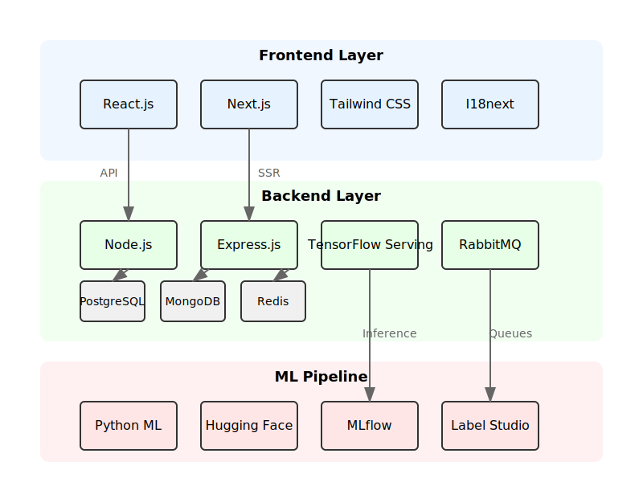

# Birbal AI Tech Stack Architecture

This document provides an overview of the Birbal AI tech stack architecture, explaining how different components interact to form a complete system.

## Architecture Overview

The Birbal AI technology stack is organized into three main layers:

1. **Frontend Layer** - Client-facing user interface
2. **Backend Layer** - API services, databases, and business logic
3. **ML Pipeline** - Machine learning model training and inference

## System Components and Data Flow

### Data Flow

1. Users interact with the Frontend Layer (React/Next.js)
2. Frontend communicates with Backend APIs (Express.js)
3. Backend processes requests, interacts with databases, and calls ML services
4. ML services provide intelligent responses based on trained models
5. Results flow back to the user through the Backend and Frontend

### Communication Patterns

- REST APIs between Frontend and Backend
- Message queues (RabbitMQ) for asynchronous processing
- WebSockets for real-time updates
- gRPC for ML service communication

## Component Interaction

### Frontend to Backend
- React components make API calls to Express.js backend
- Authentication flow using JWT tokens
- Real-time updates via WebSockets

### Backend to Databases
- PostgreSQL for structured relational data
- MongoDB for document-based unstructured content
- Redis for caching and session management

### Backend to ML Services
- API calls to TensorFlow Serving for inference
- Integration with Hugging Face models for NLP tasks

### ML Pipeline to Storage
- Training data stored in AWS S3
- Model artifacts managed by MLflow
- Human annotation integration via Label Studio

## Scalability Considerations

- Kubernetes orchestration for container management
- Horizontal scaling of stateless services
- Database sharding strategies
- Caching layers for performance optimization

## Security Architecture

- JWT-based authentication
- Role-based access control
- Data encryption at rest and in transit
- API rate limiting and protection

## Deployment Architecture

The stack is designed to be deployed in a cloud environment with the following components:

- Container orchestration with Kubernetes
- CI/CD pipeline for automated deployments
- Monitoring and logging infrastructure
- High availability configuration

## Development Environment

The local development environment mirrors the production architecture but uses:

- Local Docker containers
- Development databases
- Mock ML services where appropriate

For more detailed information on specific components, refer to the respective documentation sections:
- [Frontend Documentation](FRONTEND.md)
- [Backend Documentation](BACKEND.md)
- [ML Pipeline Documentation](ML_PIPELINE.md)
- [Integration Guide](INTEGRATION.md)
